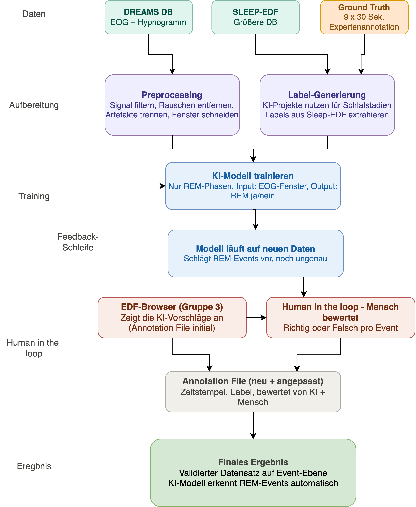
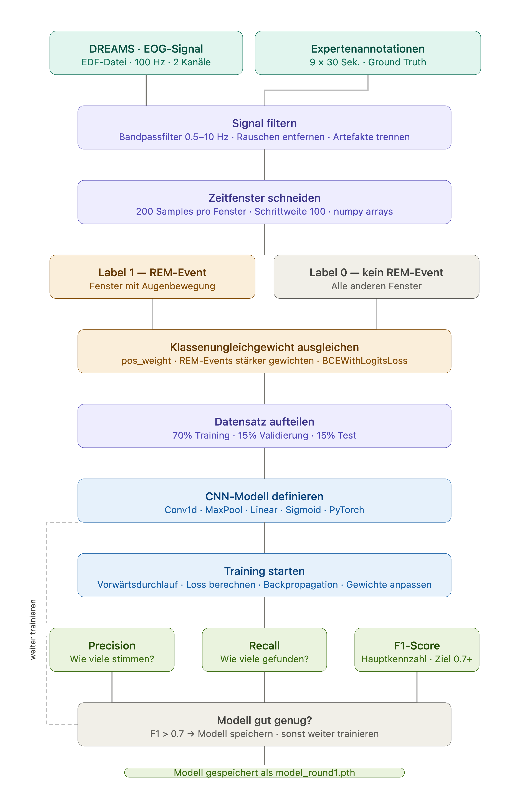

# Datenstrukturen_KI

1. EOG-Daten vorbereiten 

- EDF-Dateien laden
- EOG-Kanäle auswählen
- Signal schneiden, z. B. in 1–5-Sekunden-Fenster
- REM-Abschnitte aus dem Hypnogramm extrahieren

3. Labels vorbereiten

- vorhandene REM-Labels aus Sleep-EDF/DREAMS nutzen
- manuelle Annotationen einlesen
- Annotationen in ein Format bringen, das die KI versteht

5. KI-Netz trainieren
   
- Input: EOG-Signal
- Output: „REM-Ereignis“, „kein REM“, „Artefakt“ oder „unsicher“
- Ziel: schnelle Augenbewegungen erkennen

6. KI-Vorschläge erzeugen

- Modell markiert mögliche REM-Ereignisse im Signal
- diese Vorschläge werden später im Browser angezeigt

## Workflow des gesamten Projekts:

  

## Workflow der KI-Gruppe:

  

